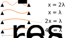

# Linear Array Resolution

> Joseph P. Vantassel, The University of Texas at Austin

## Basic Concept

When planning surface wave arrays, it is important to consider an array's
theoretical resolution relative to the desired depth of profiling and near
surface resolution. In practice, the number of receivers will generally be fixed
by the equipment available. So for the case of 1D (i.e., linear) arrays, the
only choice then is the receiver spacing. Larger receiver spacings will result
in longer arrays and generally allow for the resolution of lower frequencies
(i.e., increased resolution at depth), shorter receiver spacings will result in
shorter arrays and generally allow for resolution of high frequencies (i.e.,
better near-surface resolution). It may seem then that if the goal is to
profile as deep as possible very long arrays would be ideal. However, this is
generally not practical for two reasons. Fist, increasing the length of your
array requires increasing the size and power of your source. Second, larger
arrays require longer spacings and increase the potential for spatial aliasing
(discussed next). Very short arrays, by contrast, do not have such limitations
and have been applied successfully to a number of very near-surface applications
such as stiffness measurements of pavement and foundation system.

In the previous section spatial aliasing was presented as one of the two
short falls of using large receiver spacings. The details surrounding
spatial aliasing, is the focus of this section. A simplified linear array
composed of two stations at a spacing (x) is presented in the figure below.
The array is presented four times, each time recording a different
wavelength (λ). The wavelength for each example is presented as some factor/multiple
of x. The first two examples (x=2λ and x=λ) illustrate spatial aliasing, as the
wave is improperly sampled. Improperly sampled, in this context means fewer than
two samples per wavelength, this is similar to the Shannon-Nyquist time-domain
sampling theorem. When the waves are incorrectly sampled we will incorrectly
infer the number of wavelengths between the two receivers (at a given frequency)
and therefore incorrectly identify the wave's phase velocity (i.e., incorrect
dispersion data). The next curve(2x=λ) is at the
threshold of proper sampling (i.e., exactly two samples per wavelength). The
wavelength in this case is the resolution wavelength (λres). The final curve
(4x=λ) shows an over-sampled wavelength (i.e., more than two samples per
wavelength). In summary, when we process surface wave dispersion data we need to
be aware of the limitations imposed by the recording array. In 1D this array
resolution applies to all wavelengths less than λres or 2*x.

